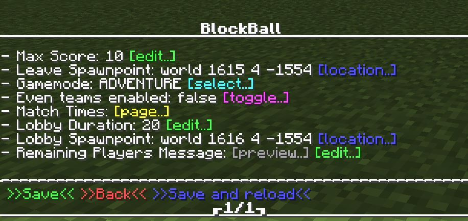
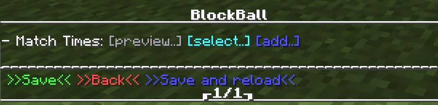
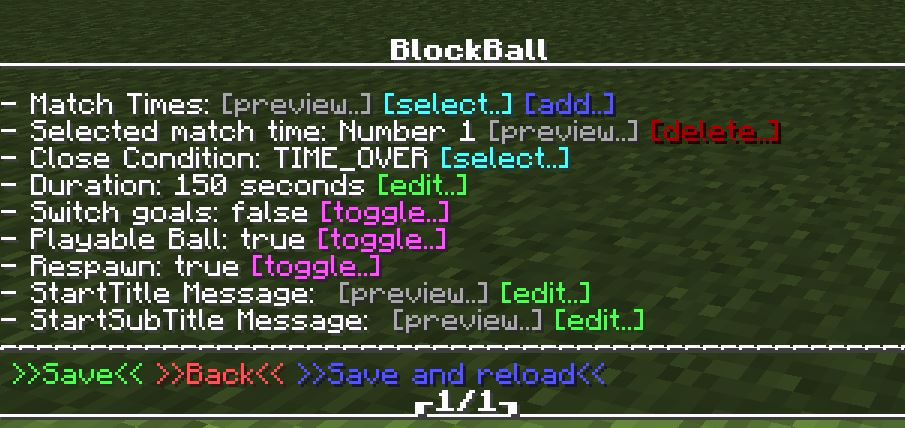

Periods
=======

.. note:: These options are only available for the **MiniGamemode**.

It is often the case that you want to split your game into half times, over times or other kinds of periods.
BlockBall supports to add and customize as many periods you like.

.. image:: ../_static/images/matchtime1.JPG

When you create a new minigame, it comes with 6 preconfigured periods.

* First period
    * Close condition "TIME_OVER" (ends when the duration has passed)
    * Duration 150 seconds
    * Spawned ball
    * Respawn of players
    * No goal switch
    * No messages
* Second period
    * Close condition "NEXT_GOAL" (ends when a goal gets scored or the duration has passed)
    * Duration 15 seconds
    * Spawned ball
    * No respawn of players
    * No goal switch
    * Message "Over Time"
* Third period
    * Close condition "TIME_OVER" (ends when the duration has passed)
    * Duration 10 seconds
    * No spawned ball
    * No respawn of players
    * No goal switch
    * Message "Break"
* Fourth period
    * Close condition "TIME_OVER" (ends when the duration has passed)
    * Duration 150 seconds
    * Spawned ball
    * Respawn of players
    * Goal switch
    * No messages
* Fifth period
    * Close condition "NEXT_GOAL" (ends when a goal gets scored or the duration has passed)
    * Duration 15 seconds
    * Spawned ball
    * No respawn of players
    * No goal switch
    * Message "Over Time"
* Sixth period
    * Close condition "TIME_OVER" (ends when the duration has passed)
    * Duration 10 seconds
    * No Spawned ball
    * No respawn of players
    * No goal switch
    * No messages

Configuring ingame
~~~~~~~~~~~~~~~~~~

1. Go to the **Settings Page** of your arena
2. Open the **Game Settings Page**

3. Open the **Match Times Page**

4. Select or add a new match time

5. Customize the available options to your own needs.

You can find all options explained at the bottom of this page.

Configuring in your arena_x.yml
~~~~~~~~~~~~~~~~~~~~~~~~~~~~~~~

At this stage, you should be able to find your arena save file. If not, please take a look at this `page <../general/database.html#editing-the-arena-files>`__.

1. Go to the **Open the arena_x.yml** of your arena
2. Search for the following section:

**arena_x.yml**

.. code-block:: yaml

    match-times:
        '1':
          duration: 150
          close-type: TIME_OVER
          switch-goals: false
          ball-playable: true
          respawn: true
          start-message-title: ''
          start-message-subtitle: ''
        '2':
          duration: 15
          close-type: NEXT_GOAL
          switch-goals: false
          ball-playable: true
          respawn: false
          start-message-title: §6Overtime
          start-message-subtitle: Only a few seconds left
        '3':
          duration: 10
          close-type: TIME_OVER
          switch-goals: false
          ball-playable: false
          respawn: false
          start-message-title: §6Break
          start-message-subtitle: Take a short break
        '4':
          duration: 150
          close-type: TIME_OVER
          switch-goals: true
          ball-playable: true
          respawn: true
          start-message-title: ''
          start-message-subtitle: ''
        '5':
          duration: 15
          close-type: NEXT_GOAL
          switch-goals: false
          ball-playable: true
          respawn: false
          start-message-title: §6Overtime
          start-message-subtitle: Only a few seconds left
        '6':
          duration: 10
          close-type: TIME_OVER
          switch-goals: false
          ball-playable: false
          respawn: false
          start-message-title: ''
          start-message-subtitle: ''

3. Customize the available options to your own needs.

Properties
~~~~~~~~~~

* Close-type: The condition when this period ends. Can be TIME_OVER (ends when the duration has passed) or NEXT_GOAL (ends when a goal gets scored or the duration has passed).
* Duration: Duration in seconds until this period ends.
* Switch goals: Should the goals be switched when this period starts?
* Playable ball: Should the ball be available during this period?
* Respawn: Should the players respawn at their team spawnpoint or ball spawnpoint when this period starts?
* StartTitle: Title of the message being sent to players when this period starts.
* StartSubTitle: Title of the message being sent to players when this period starts.