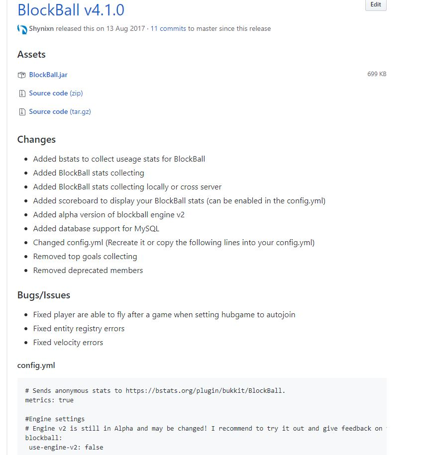

Updating
========

.. toctree::

General
~~~~~~~

Please **carefully** read the update log on github before you download a new version of PetBlocks!

The most messages and issues I receive are from players who forgot to read them, **do not become such a person as this holds me back from fixing actual issues**!

Upgrading from the previous to next version
~~~~~~~~~~~~~~~~~~~~~~~~~~~~~~~~~~~~~~~~~~~

This is a screenshot from the update log on github. Can you see the config.yml section? This means the config.yml has changed so it is
your duty to copy these lines at the correct place into your config.yml.

If you are not capable of this you have to delete your old config.yml
in the PetBlocks folder.

Upgrading from any version to the latest version
~~~~~~~~~~~~~~~~~~~~~~~~~~~~~~~~~~~~~~~~~~~~~~~~

It is highly recommend to read and apply **every update log** from the version you are currently using to the
version you want to use.

For example if you you are using PetBlocks v6.2.3 and want to use PetBlocks v6.3.1 you need to read the update log of
PetBlocks v6.3.0 and PetBlocks v6.3.1 and apply all changes.

If you do not care about your saves or your config the easiest way is to simple delete the PetBlocks folder.

Upgrading to the new permissions
~~~~~~~~~~~~~~~~~~~~~~~~~~~~~~~~

As the new options from 2017 do not share the same names with the origin permission, it was necessary to rename them.
You can find a list with the old and the new names below.

**Permissions for commands**

===================================================  =================================  =======
Description                                          Old                                New
===================================================  =================================  =======
Allows to use the /petblock command                  petblocks.use                      petblocks.command.use
Allows to use the /petblocks administration command  petblocks.commands                 petblocks.command.admin
Allows to use the /petblockreload command            petblocks.reload                   petblocks.command.reload
===================================================  =================================  =======

**Permissions for actions**

===================================================  =================================  =======
Description                                          Old                                New
===================================================  =================================  =======
Allows to rename your pet                            petblocks.pet.rename               petblocks.action.rename
Allows to use any skin what a player enters in chat  petblocks.pet.skin                 petblocks.action.customskin
Allows to ride your pet                              petblocks.pet.ride                 petblocks.action.ride
Allows to wear your pet                              petblocks.pet.wear                 petblocks.action.wear
Allows to shoot your pet                             petblocks.pet.cannon               petblocks.action.cannon
===================================================  =================================  =======

**Permissions for selections**

===================================================  =================================================  =======
Description                                          Old                                                New
===================================================  =================================================  =======
Allows to use all pet engines                        petblocks.pet.type.all                             petblocks.selection.engines.all
Allows to use a single pet engine                    petblocks.pet.type.<number>                        petblocks.selection.engines.<number>
Allows to use all simple block costumes              petblocks.pet.defaultcostumes.all                  petblocks.selection.simpleblockcostumes.all
Allows to use a single simple block costume          petblocks.pet.defaultcostumes.<number>             petblocks.selection.simpleblockcostumes.<number>
Allows to use all colored block costumes             petblocks.pet.colorcostumes.all                    petblocks.selection.coloredblockcostumes.all
Allows to use a single colored block costume         petblocks.pet.colorcostumes.<number>               petblocks.selection.coloredblockcostumes.<number>
Allows to use all player head costumes               petblocks.pet.customcostumes.all                   petblocks.selection.playerheadcostumes.all
Allows to use a single player head costume           petblocks.pet.customcostumes.<number>              petblocks.selection.playerheadcostumes.<number>
Allows to use all pet costumes                       petblocks.pet.minecraft-heads-costumes.all         petblocks.selection.petcostumes.all
Allows to use a single pet costume                   petblocks.pet.minecraft-heads-costumes.<number>    petblocks.selection.petcostumes.<number>
Allows to use all particles                          petblocks.pet.particles.all                        petblocks.selection.particles.all
Allows to use a single particle                      petblocks.pet.particles.<number>                   petblocks.selection.particles.<number>
Allows to use all head database costumes             petblocks.pet.head-database-costumes.all           petblocks.selection.headdatabasecostumes.all
===================================================  =================================================  =======
