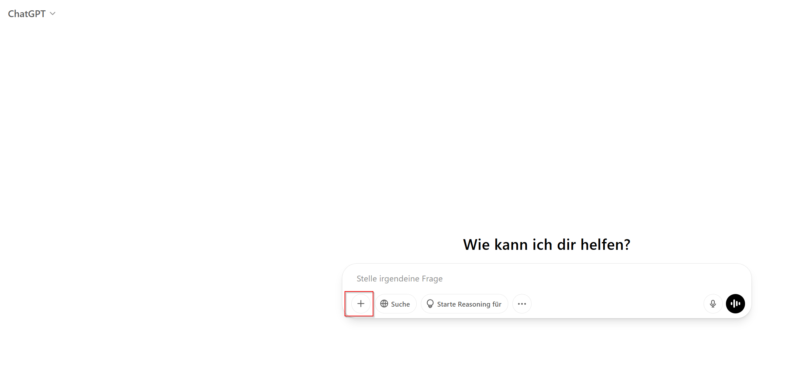
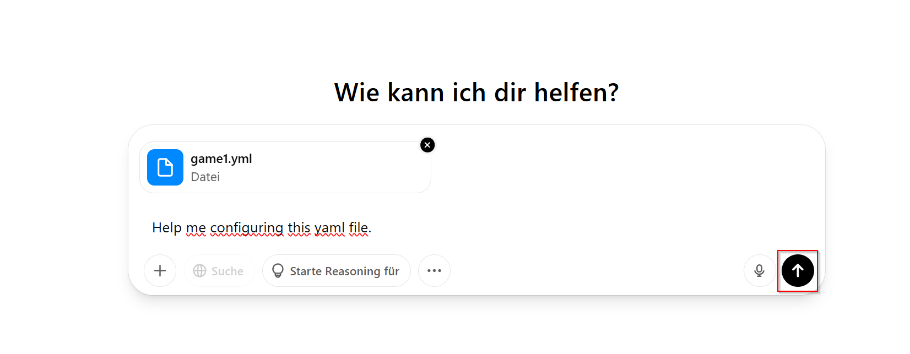
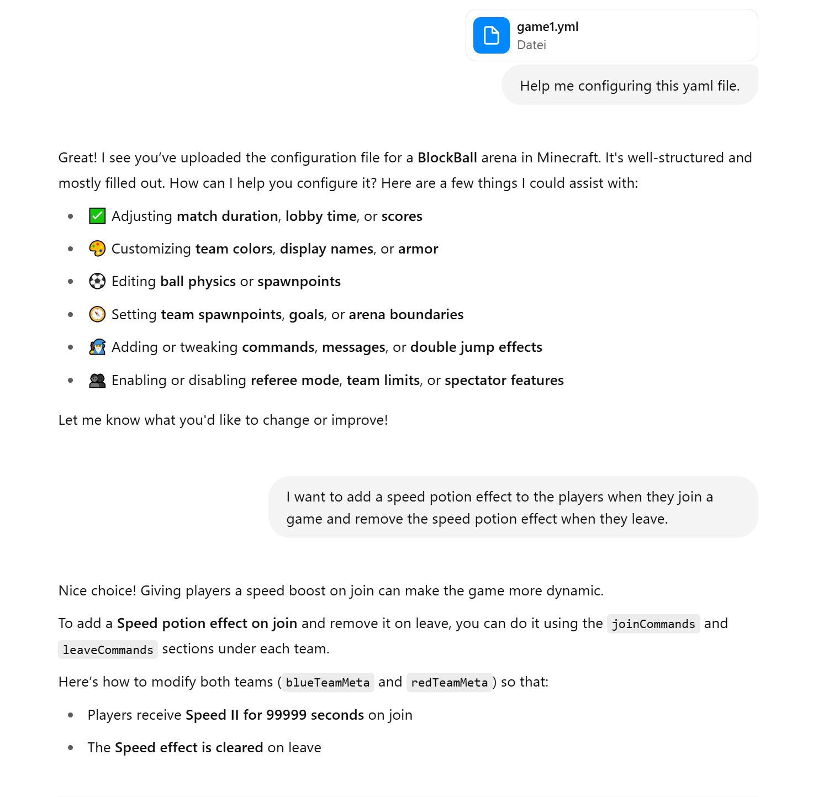
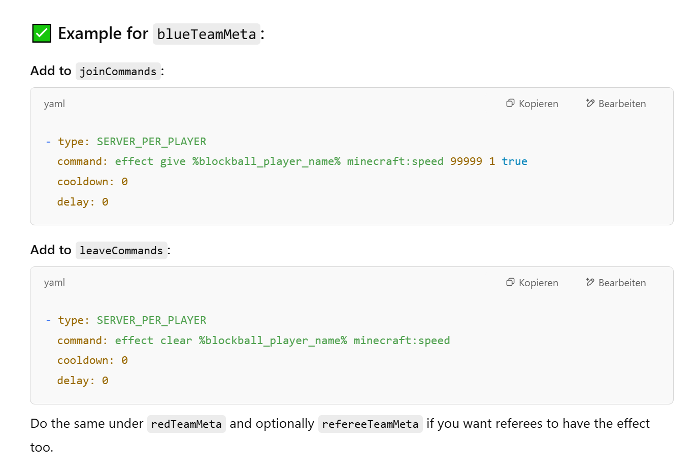
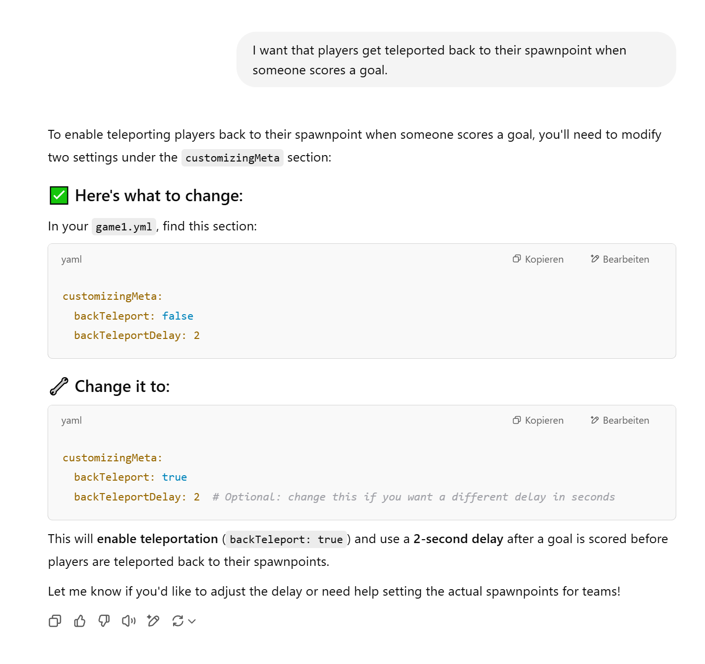

# Advanced Customization

Take your BlockBall arenas to the next level with extensive customization options. This guide covers everything from basic tweaks to advanced configurations using AI assistance.

## 🎯 Overview

BlockBall offers hundreds of configuration options through arena YAML files. These files control everything from game mechanics to visual effects, allowing you to create unique gameplay experiences.

---

## 📁 Configuration Files

### Location
All arena customizations are stored in YAML files located at:
```
/plugins/BlockBall/arena/<arena_name>.yml
```

For example, if your arena is named `game1`, the file will be:
```
/plugins/BlockBall/arena/game1.yml
```

### Editing Workflow
1. **Stop the arena**: `/blockball toggle <arena_name>` (if enabled)
2. **Edit the YAML file** using your preferred text editor
3. **Apply changes**: `/blockball reload <arena_name>`
4. **Test your changes** in-game

!!! tip "Text Editor Recommendations"
    - **Notepad++** (Windows) - Free with YAML syntax highlighting
    - **Visual Studio Code** - Cross-platform with excellent YAML support
    - **Sublime Text** - Lightweight with good plugin support

---


## 🔧 Common Customization Categories

### Game Mechanics
- **Scoring Rules**: Points per goal, win conditions, overtime rules
- **Physics**: Ball speed, gravity, bounce behavior, player knockback
- **Timing**: Game duration, period lengths, countdown timers

### Team Configuration  
- **Team Settings**: Names, colors, maximum players per team
- **Equipment**: Default armor, tools, inventory items
- **Spawn Behavior**: Respawn rules, spawn protection, team switching

### Visual & Audio
- **Particle Effects**: Goal celebrations, ball trails, area markers
- **Sound Effects**: Custom sounds for events, ambient audio
- **Scoreboard Display**: Layout, colors, update frequency

### Permissions & Restrictions
- **Player Abilities**: Flying, breaking blocks, using commands
- **Inventory Management**: Item restrictions, equipment changes
- **Command Access**: Available commands during gameplay

### Integration Features
- **PlaceholderAPI**: Custom placeholders for external plugins
- **Hook Systems**: Integration with economy, permission, and other plugins
- **Statistics**: Player tracking, leaderboards, achievement systems

---

## 📖 Configuration File Structure

### Essential Arena Properties

```yaml
# Unique arena identifier and display settings
name: game1
displayName: "My first game"
enabled: true
gameType: MINIGAME  # HUBGAME, MINIGAME, REFEREEGAME

# World boundaries - defines the playable area
corner1:
  world: world
  x: 1597.99
  y: 10.0
  z: -1588.01
corner2:
  world: world
  x: 1577.0
  y: 3.0
  z: -1627.0

# Ball spawn location in the center of the field
ballSpawnPoint:
  world: world
  x: 1586.99
  y: 4.0
  z: -1606.26
  yaw: 38.85
  pitch: 45.45
```

### Ball Configuration

```yaml
ball:
  # Visual appearance
  render:
    scale: 1.0  # Ball size. You can set anything here in modern Minecraft versions. For older Minecraft versions only use 1.0 and 0.5.
    rotating: true
    offSetY: -1.0  # Vertical offset for visual positioning
    
  # Player interaction settings
  hitbox:
    clickHitBoxSize: 1.5
    touchHitBoxSize: 1.0
    leftClickEnabled: true
    rightClickEnabled: true
    touchEnabled: true
    interactionCoolDownTicks: 20
    leftClickRightClickDelayTicks: 1
    interactionCoolDownPerPlayerTicks: 7
    slimeVisible: false
    
  # Physics properties
  gravityModifier: 0.07      # How fast ball falls
  airResistance: 0.001       # Speed reduction in air
  rollingResistance: 0.1     # Speed reduction on ground
  shotVelocity: 1.5          # Power of left-click shots
  shotPassYVelocityOverwrite: 1.0  # Vertical modifier override
  passVelocity: 1.2          # Power of right-click passes
```

### Team Setup

```yaml
# Example team configuration
blueTeamMeta:
  displayName: '&9Team Blue'
  pointsPerGoal: 1
  minAmount: 0      # Minimum players to start
  maxAmount: 10     # Maximum team size
  
  # Goal area definition
  goal:
    corner1:
      world: world
      x: 1591.99
      y: 8.99
      z: -1626.01
    corner2:
      world: world
      x: 1584.0
      y: 3.0
      z: -1631.0
      
  # Team spawn points
  spawnpoint:        # In-game spawn
    world: world
    x: 1589.47
    y: 4.0
    z: -1619.19
  lobbySpawnpoint:   # Lobby spawn
    world: world
    x: 1603.18
    y: 4.0
    z: -1602.58
```

### Game Periods and Timing

```yaml
# Match structure with multiple periods
minigameMeta:
  lobbyDuration: 20    # Countdown before match starts
  matchTimes:
    - duration: 150          # First half (2.5 minutes)
      closeType: TIME_OVER
      switchGoals: false
      playAbleBall: true
      respawnEnabled: true
      startMessageTitle: ''
      startMessageSubTitle: ''
      startMessageFadeIn: 20
      startMessageStay: 60
      startMessageFadeOut: 20
      
    - duration: 10           # Halftime break
      closeType: TIME_OVER
      switchGoals: false
      playAbleBall: false    # No ball during break
      respawnEnabled: false
      startMessageTitle: ''
      startMessageSubTitle: '&0&l[&f&lBreak&0&l]&7'
      startMessageFadeIn: 20
      startMessageStay: 60
      startMessageFadeOut: 20
      
    - duration: 150          # Second half
      closeType: TIME_OVER
      switchGoals: true      # Teams switch sides
      playAbleBall: true
      respawnEnabled: true
      startMessageTitle: ''
      startMessageSubTitle: ''
      startMessageFadeIn: 20
      startMessageStay: 60
      startMessageFadeOut: 20
```

### Command Integration

```yaml
# Commands executed when players join teams
joinCommands:
  - type: SERVER_PER_PLAYER
    command: /blockballscoreboard add blockball_scoreboard %blockball_player_name%
    cooldown: 0
    delay: 0
    
  - type: SERVER_PER_PLAYER  
    command: /blockballbossbar add blockball_bossbar %blockball_player_name%
    cooldown: 0
    delay: 0

# Commands when players leave
leaveCommands:
  - type: SERVER_PER_PLAYER
    command: /blockballscoreboard remove blockball_scoreboard %blockball_player_name%
    
  - type: SERVER_PER_PLAYER
    command: /blockballbossbar remove blockball_bossbar %blockball_player_name%
```

---

## ⚙️ Detailed Game Mechanics

### Ball Physics Deep Dive

Understanding ball physics is crucial for creating the right gameplay feel:

```yaml
ball:
  # Gravity and movement
  gravityModifier: 0.07        # Higher = ball falls faster
  airResistance: 0.001         # Higher = ball slows down more in air
  rollingResistance: 0.1       # Higher = ball stops rolling sooner
  
  # Player interaction strengths
  horizontalTouchModifier: 1.0  # Running into ball power
  verticalTouchModifier: 1.0    # Jump-touch ball power
  shotVelocity: 1.5            # Left-click power shot
  shotPassYVelocityOverwrite: 1.0  # Override vertical shot modifier
  passVelocity: 1.2            # Right-click gentle pass
  
  # Ball rotation and limits
  maximumSpinVelocity: 0.08    # How much the ball can spin
  maximumPitch: 60             # Highest angle ball can fly
  minimumPitch: 0              # Lowest angle (ground level)
  defaultPitch: 20             # Standard launch angle
```

### Player Movement and Abilities

```yaml
meta:
  doubleJumpMeta:
    enabled: true              # Allow double jumping
    cooldown: 2                # Seconds between double jumps
    verticalStrength: 1.0      # Jump height multiplier
    horizontalStrength: 2.0    # Forward momentum multiplier
    soundEffect:
      name: ENTITY_WIND_CHARGE_WIND_BURST,ENTITY_GHAST_SHOOT,GHAST_FIREBALL
      volume: 10.0
      pitch: 1.0
      
meta:
  customizingMeta:
    damageEnabled: false       # Players can't take damage
    backTeleport: false        # Auto-teleport after goals
    backTeleportDelay: 2       # Delay before teleporting
    keepInventoryEnabled: false # Players lose items when joining
    keepHealthEnabled: true    # Maintain health when joining
    queueTimeOutSec: 30        # Max queue wait time for MINIGAME mode
    ignoreGoalSize: false      # Allow very small goals
    gameStartBallSpawnDelayTicks: 2   # Ball spawn delay on game start
    goalScoredBallSpawnDelayTicks: 1  # Ball spawn delay after goals
  minigameMeta:
    forceFieldEnabled: true    # Invisible walls keep players in bounds
  protectionMeta:
    rejoinProtectionEnabled: true     # Apply velocity when rejoining
    rejoinProtection:
      x: 1.0
      y: 2.0
      z: 0.0
```

### Advanced Team Configuration

```yaml
# Complete team setup example
redTeamMeta:
  displayName: '&cTeam Red'
  pointsPerGoal: 1             # Points awarded per goal
  pointsPerEnemyDeath: 0       # Points for opponent deaths
  minAmount: 0                 # Minimum players to start match
  maxAmount: 10                # Team size limit
  minPlayingPlayers: 0         # Minimum to keep game running
  
  # Team equipment (auto-equipped on join)
  armor:
    - item: LEATHER_BOOTS with RED color
    - item: LEATHER_LEGGINGS with RED color  
    - item: LEATHER_CHESTPLATE with RED color
    - item: null (no helmet)
    
  # Custom inventory items
  inventory:
    - null  # All 36 slots can be configured
    # ... (slots 1-35 shown as null in example)
```

### Game Mode Variations

#### MINIGAME Mode
- **Structure**: Lobby → Match → Results → Reset
- **Features**: Scheduled matches, team balancing, periods
- **Best for**: Competitive matches, tournaments

```yaml
gameType: MINIGAME
meta:
  minigameMeta:
    lobbyDuration: 20          # Pre-match countdown
    forceFieldEnabled: true    # Keep players in arena
  customizingMeta:
    queueTimeOutSec: 30        # Max wait time for players
```

#### HUBGAME Mode  
- **Structure**: Continuous play, join/leave anytime
- **Features**: Instant join, persistent scores
- **Best for**: Casual play, practice areas

```yaml
gameType: HUBGAME
meta:
  hubLobbyMeta:
    instantForcefieldJoin: false  # Show join prompt
    resetArenaOnEmpty: false      # Keep scores when empty
    teleportOnJoin: true          # Move to team spawn
```

#### REFEREEGAME Mode (Patreon Only)
- **Structure**: Manual control, referee commands
- **Features**: Pause/resume, manual scoring
- **Best for**: Official matches, streaming

---

## 🎨 Popular Customization Examples

### Fast-Paced Quick Match
```yaml
# 5-minute total game with no breaks
gameType: MINIGAME
meta:
  lobbyMeta:
    maxScore: 3              # First to 3 goals wins
  minigameMeta:
    lobbyDuration: 10        # Quick 10-second countdown
    matchTimes:
      - duration: 300        # Single 5-minute period
        closeType: TIME_OVER
        playAbleBall: true
        
# Faster ball physics
ball:
  shotVelocity: 2.0          # More powerful shots
  passVelocity: 1.8          # Faster passes
  gravityModifier: 0.05      # Ball stays in air longer
  
# Enhanced movement
meta:
  doubleJumpMeta:
    cooldown: 1              # Double jump every second
    verticalStrength: 1.5    # Higher jumps
```

### Traditional Soccer Match
```yaml
# Realistic 90-minute match structure
gameType: MINIGAME
meta:
  minigameMeta:
    lobbyDuration: 30        # 30-second pre-match
    matchTimes:
      - duration: 2700       # First half (45 min)
        closeType: TIME_OVER
        switchGoals: false
        startMessageSubTitle: '&a&lFirst Half'
        
      - duration: 900        # Halftime (15 min)
        closeType: TIME_OVER
        playAbleBall: false
        startMessageSubTitle: '&e&lHalftime Break'
        
      - duration: 2700       # Second half (45 min)
        closeType: TIME_OVER
        switchGoals: true     # Teams switch sides
        startMessageSubTitle: '&a&lSecond Half'
        
      - duration: 1800       # Extra time if tied (30 min)
        closeType: NEXT_GOAL  # Sudden death
        startMessageSubTitle: '&c&lExtra Time - Next Goal Wins!'
```

### Casual Lobby Game
```yaml
gameType: HUBGAME
meta:
  lobbyMeta:
    maxScore: 10             # Play to 10 goals
  hubLobbyMeta:
    instantForcefieldJoin: true   # Auto-join when entering
    resetArenaOnEmpty: true       # Reset when no players
    teleportOnJoin: false         # Join where you stand
    
# Relaxed physics
ball:
  shotVelocity: 1.0          # Standard power
  rollingResistance: 0.2     # Ball stops rolling sooner
  
# No special abilities  
meta:
  doubleJumpMeta:
    enabled: false           # Disable double jumping
  customizingMeta:
    forceFieldEnabled: false # Players can leave field
```

### Speed Soccer Mode
```yaml
# High-speed, low-gravity soccer
ball:
  render:
    scale: 0.7               # Smaller, faster ball
  shotVelocity: 3.0          # Extremely powerful shots
  passVelocity: 2.5          # Fast passes
  gravityModifier: 0.02      # Low gravity, floaty ball
  airResistance: 0.0005      # Ball maintains speed longer
  
meta:
  doubleJumpMeta:
    cooldown: 0.5            # Double jump twice per second
    verticalStrength: 2.0    # Super high jumps
    horizontalStrength: 3.0  # Rocket-like movement
    
  customizingMeta:
    damageEnabled: false     # No fall damage from high jumps
```

### Beginner-Friendly Setup
```yaml
# Easy mode for new players
ball:
  render:
    scale: 1.5               # Bigger ball, easier to see/hit
  hitbox:
    clickHitBoxSize: 2.0     # Larger click area
    touchHitBoxSize: 1.5     # Easier to run into
    interactionCoolDownTicks: 10  # Faster interaction
    
  shotVelocity: 0.8          # Gentler shots
  passVelocity: 0.6          # Slower passes
  gravityModifier: 0.1       # Ball doesn't fly too high
  
meta:
  lobbyMeta:
    maxScore: 15             # Longer games
  minigameMeta:
    lobbyDuration: 45        # More time to prepare
  customizingMeta:
    backTeleport: true       # Reset positions after goals
    backTeleportDelay: 3     # Give time to see the goal
```

---

## 🎵 Sound Effects and Audio

### Ball Interaction Sounds

```yaml
ball:
  soundEffects:
    ONKICK:
      # Multiple sound names for different Minecraft versions
      name: ENTITY_ZOMBIE_ATTACK_WOODEN_DOOR,ENTITY_ZOMBIE_ATTACK_DOOR_WOOD,ZOMBIE_WOOD
      volume: 10.0           # Sound volume (0.0 to 10.0)
      pitch: 1.5             # Sound pitch (0.5 to 2.0)
      effectType: EVERYONE   # Who hears it: EVERYONE, TEAM, SELF
```

### Countdown and UI Sounds

```yaml
meta:
  minigameMeta:
    countdownSound:
      name: BLOCK_NOTE_BLOCK_PLING,BLOCK_NOTE_PLING,NOTE_PLING
      volume: 10.0
      pitch: 2.0
      effectType: EVERYONE
      
  doubleJumpMeta:
    soundEffect:
      name: ENTITY_WIND_CHARGE_WIND_BURST,ENTITY_GHAST_SHOOT,GHAST_FIREBALL
      volume: 10.0
      pitch: 1.0
      effectType: EVERYONE
```

### Custom Sound Examples

!!! info "Sound Configuration"
    The examples below show how you could configure additional sounds if they were supported. Currently, BlockBall supports ball interaction sounds (`ONKICK`), countdown sounds, and double jump sounds as shown in the sections above.

```yaml
# These are example configurations - check plugin documentation 
# for currently supported sound events

# Goal celebration sound (example)
goalScoredSound:
  name: ENTITY_PLAYER_LEVELUP,LEVEL_UP
  volume: 8.0
  pitch: 1.2
  effectType: EVERYONE

# Whistle for game start (example)
gameStartSound:
  name: ENTITY_ARROW_SHOOT,SHOOT_ARROW
  volume: 5.0
  pitch: 0.8
  effectType: EVERYONE
  
# Crowd cheer using note blocks (example)
crowdCheerSound:
  name: BLOCK_NOTE_BLOCK_CHIME,NOTE_PIANO
  volume: 6.0
  pitch: 1.8
  effectType: EVERYONE
```

---

## 🏆 Team Equipment and Visual Identity

### Leather Armor Color System

BlockBall uses leather armor with custom colors for team identification:

```yaml
# Team Red armor configuration
redTeamMeta:
  armor:
    - |
      item:
        ==: org.bukkit.inventory.ItemStack
        v: 4554
        type: LEATHER_BOOTS
        meta:
          ==: ItemMeta
          meta-type: COLORABLE_ARMOR
          color:
            ==: Color
            ALPHA: 255
            RED: 255    # Full red
            GREEN: 0    # No green
            BLUE: 0     # No blue
```

### Color Examples for Teams

```yaml
# Classic team colors
# Red Team: RGB(255, 0, 0)
# Blue Team: RGB(0, 0, 255)
# Green Team: RGB(0, 255, 0)
# Yellow Team: RGB(255, 255, 0)
# Purple Team: RGB(128, 0, 128)
# Orange Team: RGB(255, 165, 0)
# Pink Team: RGB(255, 192, 203)
# Cyan Team: RGB(0, 255, 255)
```

### Custom Ball Appearance

```yaml
ball:
  render:
    # Custom ball item (soccer ball head texture)
    item:
      typeName: PLAYER_HEAD,397
      amount: '1'
      durability: '3'
      # Base64 encoded soccer ball skin
      skinBase64: eyJ0ZXh0dXJlcyI6eyJTS0lOIjp7InVybCI6Imh0dHBzOi8vdGV4dHVyZXMubWluZWNyYWZ0Lm5ldC90ZXh0dXJlLzhlNGE3MGI3YmJjZDdhOGMzMjJkNTIyNTIwNDkxYTI3ZWE2YjgzZDYwZWNmOTYxZDJiNGVmYmJmOWY2MDVkIn19fQ==
      
    # Ball positioning and rotation
    rotating: true           # Ball spins as it moves
    offSetY: -1.0           # Visual height adjustment
```

### Understanding Command Types

BlockBall supports three types of command execution:

- **SERVER**: Execute as console (admin privileges)
- **SERVER_PER_PLAYER**: Execute as console for each player individually  
- **PER_PLAYER**: Execute as the player themselves

### Essential Command Integration

```yaml
# Automatic scoreboard and bossbar setup
joinCommands:
  - type: SERVER_PER_PLAYER
    command: /blockballscoreboard add blockball_scoreboard %blockball_player_name%
    cooldown: 0
    delay: 0
    playerPermission: ''  # Optional permission requirement
    
  - type: SERVER_PER_PLAYER
    command: /blockballbossbar add blockball_bossbar %blockball_player_name%
    cooldown: 0
    delay: 0

# Cleanup when players leave
leaveCommands:
  - type: SERVER_PER_PLAYER
    command: /blockballscoreboard remove blockball_scoreboard %blockball_player_name%
    
  - type: SERVER_PER_PLAYER
    command: /blockballbossbar remove blockball_bossbar %blockball_player_name%
```

### Event-Based Commands

```yaml
# Goal celebration commands
goalCommands:
  - type: SERVER
    command: /tellraw @a ["",{"text":"GOAL! ","color":"gold","bold":true},{"text":"%blockball_player_name%","color":"yellow"},{"text":" scores for ","color":"white"},{"text":"%blockball_team_displayName%","color":"aqua"}]
    delay: 10  # Wait 0.5 seconds after goal
    
# Game start announcements  
gameStartCommands:
  - type: SERVER
    command: /title @a title {"text":"MATCH START!","color":"green","bold":true}
    
  - type: SERVER  
    command: /playsound minecraft:entity.ender_dragon.growl master @a ~ ~ ~ 1 1.2
    delay: 20

# Win/lose rewards
winCommands:
  - type: SERVER_PER_PLAYER
    command: /give %blockball_player_name% diamond 1
    
  - type: PER_PLAYER
    command: /msg %blockball_player_name% Congratulations on your victory!

# Tournament integration
backTeleportCommands:  # After each goal
  - type: SERVER
    command: /tournament match update %blockball_game_name%
```

### Available Placeholders

Use these placeholders in commands to access game data:

- `%blockball_player_name%` - Player's username
- `%blockball_team_displayName%` - Team's display name  
- `%blockball_game_name%` - Arena name
- `%blockball_game_displayName%` - Arena display name
- `%blockball_team_score%` - Current team score
- `%blockball_enemy_score%` - Opposing team score

### Economy Integration Example

```yaml
# Reward system with economy plugin
goalCommands:
  - type: SERVER_PER_PLAYER
    command: /eco give %blockball_player_name% 100
    
winCommands:
  - type: SERVER_PER_PLAYER  
    command: /eco give %blockball_player_name% 500
    
  - type: SERVER_PER_PLAYER
    command: /give %blockball_player_name% gold_ingot 3
    playerPermission: "myplayers.vip" # If this is set, only players with this permission receive the gold ingots.

looseCommands:
  - type: SERVER_PER_PLAYER
    command: /eco give %blockball_player_name% 50  # Participation reward
```

---

## 🔄 Testing and Iteration

### Testing Workflow
1. **Make small changes** - Test one feature at a time
2. **Use test server** - Avoid disrupting live gameplay  
3. **Get player feedback** - Real users provide valuable insights
4. **Document changes** - Keep notes on what works well

### Common Issues and Solutions

| Problem | Likely Cause | Solution |
|---------|-------------|----------|
| Arena won't load | YAML syntax errors | Use online YAML validator, check indentation |
| Ball doesn't spawn | ballSpawnPoint coordinates wrong | Verify coordinates are within corner1/corner2 bounds |
| Teams can't score | Goal coordinates incorrect | Check goal corner1/corner2 define valid goal areas |
| Players stuck in walls | Spawn points inside blocks | Move spawnpoint coordinates to open areas |
| Commands not executing | Wrong command type or syntax | Use SERVER_PER_PLAYER for most integrations |
| Sounds not playing | Outdated sound names | Use comma-separated names for version compatibility |
| Double jump not working | Cooldown too high or disabled | Check enabled: true and reduce cooldown value |
| Ball physics feel wrong | Velocity/gravity settings off | Start with default values and adjust gradually |
| Scoreboard errors | Missing BlockBall scoreboard plugin | Install companion plugins or remove scoreboard commands |
| Armor not colored | Incorrect RGB values | Use values 0-255 for RED, GREEN, BLUE components |

### Performance Optimization Tips

```yaml
# Reduce server load for large servers
ball:
  hitbox:
    interactionCoolDownTicks: 20      # Prevent spam clicking
    interactionCoolDownPerPlayerTicks: 7  # Per-player cooldown
    
meta:
  customizingMeta:
    gameStartBallSpawnDelayTicks: 2   # Reduce instant spawn lag
    goalScoredBallSpawnDelayTicks: 1  # Quick goal reset
    
# Limit command spam
joinCommands:
  - type: SERVER_PER_PLAYER
    command: /your-command-here
    cooldown: 100  # 5-second cooldown prevents repeated execution
```

### YAML Syntax Reminders

!!! warning "Common YAML Mistakes"
    - **Indentation**: Use spaces, not tabs. Each level = 2 spaces
    - **Colons**: Always add space after colons: `key: value`
    - **Quotes**: Use quotes around text with special characters
    - **Lists**: Start list items with `- ` (dash + space)
    - **Null values**: Use `null` for empty values, not blank

```yaml
# ✅ Correct YAML formatting
meta:
  customizingMeta:
    damageEnabled: false
    backTeleport: true
  lobbyMeta:
    maxScore: 10
    
# ❌ Incorrect formatting (will cause errors)
meta:
customizingMeta:
damageEnabled:false  # Missing space after colon
backTeleport: true
lobbyMeta:
    maxScore:10      # Missing space after colon
```

---

## 📚 Further Resources

### Learning More
- **In-game help**: `/blockball help` for command reference
- **Community forums**: Share configurations with other server owners
- **Plugin documentation**: Detailed technical references

### Advanced Topics
- **Custom scripting**: Integration with other plugins
- **Performance optimization**: Large server considerations  
- **Multi-arena management**: Coordinating multiple games
- **Event integration**: Tournament and competition setups

!!! success "Pro Tip"
    Start with small modifications and gradually build complexity. The most successful arena configurations evolve over time based on player feedback and server needs.
---

## 🤖 AI-Powered Configuration (Recommended)

### Using ChatGPT for Easy Setup

BlockBall's configuration files contain hundreds of options with detailed comments. Instead of learning every setting manually, you can use AI to make precise changes quickly and accurately.

#### Step-by-Step Process

1. **Upload your arena file** to ChatGPT
2. **Describe your desired changes** in plain English  
3. **Review the AI suggestions** before applying
4. **Apply changes manually** to your file (recommended for safety)

#### Example Conversation Flow











#### Sample AI Prompts

**Basic Game Modifications:**
```
"Change the match to have 3 periods of 5 minutes each with 2-minute breaks"
"Make the ball 50% larger and increase shot velocity to 2.0"
"Set up a quick 3-goal match with 10-second lobby countdown"
"Enable double jumping with 1-second cooldown and higher jump strength"
```

**Team and Equipment Changes:**
```
"Change team colors to green vs purple and update the armor accordingly"
"Set maximum team size to 6 players and minimum of 2 to start"
"Add custom join commands that give players a wooden sword and 64 bread"
"Configure teams to switch goals every period automatically"
```

**Ball Physics Adjustments:**
```
"Make the ball more realistic: increase gravity to 0.1, reduce air resistance"
"Create a low-gravity mode with gravityModifier 0.02 and higher shot velocity"
"Reduce ball interaction cooldown to 10 ticks for faster gameplay"
"Make the ball smaller (scale 0.7) and increase all hit box sizes"
```

**Advanced Game Modes:**
```
"Set up a sudden death overtime period that ends on next goal"
"Create a tournament mode with referee controls and manual ball spawning"  
"Configure automatic scoreboard and bossbar for all players"
"Add goal celebration commands that give rewards and play sounds"
```

**Sound and Visual Effects:**
```
"Change the ball kick sound to a more realistic soccer ball sound"
"Add countdown sounds during lobby with increasing pitch"
"Configure different sounds for goals, double jumps, and game events"
"Set up victory fanfare commands when a team wins"
```

### AI Safety Tips

!!! warning "Backup First"
    Always backup your arena files before applying AI-generated changes.

!!! tip "Manual Application"
    While ChatGPT can generate download links, manually applying suggested changes ensures file integrity and gives you better understanding.

!!! info "Verification"
    After applying changes, use `/blockball reload` and test thoroughly before going live.

---