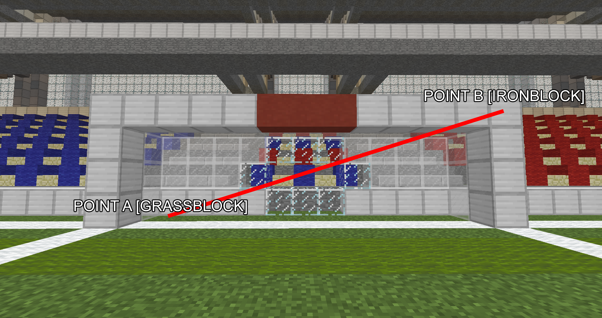

# Creating a new game

This page explains step by step to setup a new game.

### Create a new game

Execute the following command to create a new arena file.

```
/blockball create game1 My first game
```

### Confirm that the arena has been created

Execute the following command to list all games:

```
/blockball list
```

Output:

```
game1 [My first game] [disabled]
```

You can see that the arena is still disabled and cannot be joined yet.

^^### Get the selection axe

Get the blockball selection axe for selecting the spawnspoints and other areas.

```
/blockball axe
```

### Enable highlighting

You can toggle highlighting important areas when editing your game. This makes it easier to edit them.

```
/blockball highlight game1
```

### Setting the playing field

Select ``Point A`` with left-clicking using the BlockBall axe and ``Point B`` with right-clicking using the BlockBall axe.
Then execute the command below.


```
/blockball select game1 field
```

### Setting the goal of team red

Select ``Point A`` with left-clicking using the BlockBall axe and ``Point B`` with right-clicking using the BlockBall axe.
Then execute the command below.




```
/blockball select game1 red_goal
```

### Setting the goal of team blue

Select ``Point A`` with left-clicking using the BlockBall axe and ``Point B`` with right-clicking using the BlockBall axe.
Then execute the command below.


```
/blockball select game1 blue_goal
```

### Setting the ball spawnpoint

Left-click the location where you want the ball to spawn. 
Then execute the command below.

```
/blockball select game1 ball
```

### Enable the game

Once every location has been set, you can try to activate the game by executing the following:

```
/blockball toggle game1
```

Confirm that the game is listed as enabled.

```
/blockball list
```

Output:

```
game1 [My first game] [enabled]
```

### Changing more options

Further customization options can be found in the ``plugins/BlockBall/arena/<name>.yml`` file.

The ``arena_sample.yml`` file contains explanations for each property.

Execute the reload command to load your file changes.

```
/blockball reload game1
```
