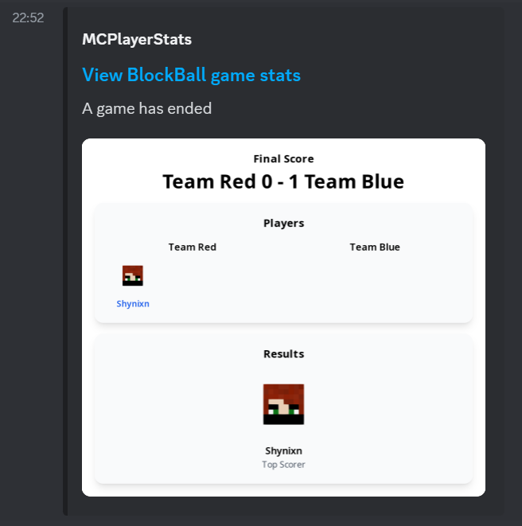

# Stats (Patreon Only)

BlockBall continuously collects stats of your players. You can display them in game via PlaceHolderApi compatible placeholders on the placeholders page.

This page deals with sharing stats and game results as a website and on Discord.

## MCPlayerStats Setup

BlockBall ships an integration of [https://mcplayerstats.com/](https://mcplayerstats.com/) which is a service to host websites. The service is included
as long as you are an active patreon member of [https://www.patreon.com/Shynixn](https://www.patreon.com/Shynixn). 
The amount of stats you can share per day is limited and is called Quota. If you want to learn more about mcplayerstats.com, see [https://shynixn.github.io/MCPlayerStatsPlugin](https://shynixn.github.io/MCPlayerStatsPlugin).

1. Login into mcplayerstats.com

    Execute the following command and open the link in your web browser.  
    ```
    /blockballstats login
    ```

2. Toggle a game

    Execute the following command twice to generate the stats pages for any existing arenas.
    
    ```
    /blockball toggle <game>
    ```

3. Play a game.

    Observe that you automatically receive a link at the end of a BlockBall game. Click that link to see the produced website.

## Limit to certain games

Generating webpages for all of your games might not be desired. Set ``mcPlayerStatsEnabled: false`` in your arena.yml file if you do not want to generate pages for a game.

## Sending game results to Discord

Instead of sending the link to a webpage at the end of a game, you can publish the game on Discord instead.

1. Set the type of the language message ``gameWebsiteMessage`` to ``HIDDEN``.

2. Open the stats definition of your game under ``plugins\BlockBall\stats\templates\``. It will be named ``game1_page.yml`` or similar.

3. Create a [Discord WebHook](https://support.discord.com/hc/en-us/articles/228383668-Intro-to-Webhooks) on your server for a certain channel. You can download the following icon to use it as avatar url.

    
    
    Copy and paste the WebHook-URL into the field in your stats definition.
    
    ```
    webHook:
     url: "<WebHook-URL>"
    ```

4. Reload the configuration

     ```
    /blockballstats reload
    ```

Play a game and observe that the game is sent ~1 minute later to your Discord Server.




